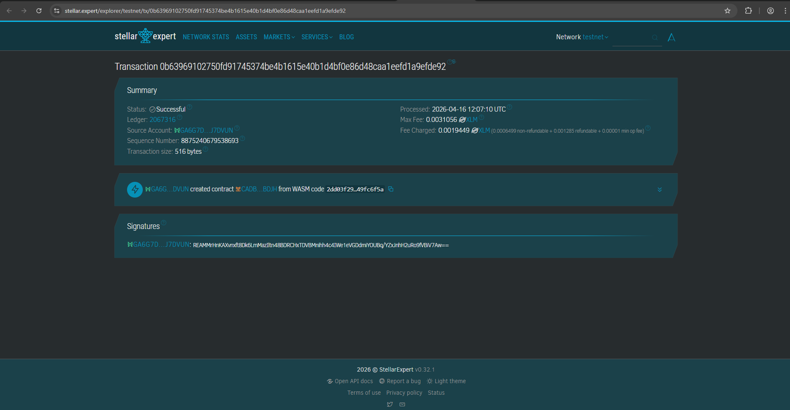

# 💸 TKI Remittance — Decentralized Money Transfer for Indonesian Migrant Workers

A blockchain-based remittance application built on **Stellar Soroban** that enables Indonesian migrant workers (TKI) to send money to their families back home in a transparent, secure, and tamper-proof way — without relying on intermediaries that may charge high fees or delay transfers.

---

## 🚨 Problem Statement

Millions of Indonesian migrant workers (TKI) send money home every month. Common challenges include:

- **High transfer fees** from traditional remittance services
- **No transparent audit trail** — families cannot verify when money was sent
- **Fraud risk** — fake transfer receipts or failed deliveries
- **No protection** if the recipient has not yet claimed the funds

This smart contract creates an on-chain remittance system where every transfer is **permanently recorded**, **verifiable**, and **protected by recipient identity verification**.

---

## ✨ Features

| Function | Description |
|---|---|
| `send_money` | TKI sends a remittance record on-chain, returns a unique Transfer ID as proof |
| `claim_money` | Family claims the transfer using Transfer ID + their NIK (identity verification) |
| `cancel_transfer` | TKI cancels a pending transfer (e.g. sent to wrong recipient) |
| `get_transfers_by_sender` | View all transfers sent by a specific TKI (by NIK) |
| `get_transfers_by_recipient` | View all incoming transfers for a specific family member (by NIK) |
| `get_transfer_by_id` | Check status of a specific transfer using Transfer ID |
| `get_all_transfers` | View all transfers on-chain (for monitoring & audit) |

---

## 🔄 Transfer Lifecycle

```
TKI sends money
      │
      ▼
  [PENDING] ──── Family claims with correct NIK ──── [CLAIMED]
      │
      └──── TKI cancels before claim ──────────────── [CANCELLED]
```

---

## 🛡️ Security Mechanisms

1. **Identity Verification** — Recipient must provide their correct NIK to claim a transfer
2. **Double-Claim Prevention** — Once claimed, a transfer cannot be claimed again
3. **Sender-Only Cancellation** — Only the original sender (verified by NIK) can cancel
4. **Immutable Timestamps** — All sent/claimed times use `env.ledger().timestamp()` — tamper-proof
5. **Permanent Audit Trail** — Every transaction is permanently stored on the Stellar blockchain

---

## 🔗 Testnet Smart Contract ID

```
Contract ID: CADBFT7FHH5YW65XBW4HSMWOOPYYKWN5YAQNNMF7URM3D4KOLGCPBDJH
Network: Stellar Testnet
```


---

## 📸 Testnet Screenshot

<!-- Replace with your actual screenshot after deploying and invoking -->


---

## 🚀 How to Use

### 1. Send Money (by TKI)
Call `send_money` with:

| Parameter | Type | Example |
|---|---|---|
| `sender_name` | String | `"Siti Aminah"` |
| `sender_id` | String | `"3578010101950001"` (NIK) |
| `sender_country` | String | `"Malaysia"` |
| `recipient_name` | String | `"Bapak Suwarno"` |
| `recipient_id` | String | `"3578010101600001"` (NIK) |
| `recipient_phone` | String | `"08123456789"` |
| `amount_usd` | u64 | `20000` (= $200.00, in cents) |
| `amount_idr` | u64 | `3100000` (= Rp 3.100.000) |
| `message` | String | `"Buat bayar sekolah adik ya Pak"` |

✅ Returns: `transfer_id` (u64) — save this as proof of transfer

---

### 2. Claim Money (by Family)
Call `claim_money` with:

| Parameter | Type | Example |
|---|---|---|
| `transfer_id` | u64 | *(ID returned from send_money)* |
| `recipient_id` | String | `"3578010101600001"` (must match) |

✅ Returns: `"Transfer claimed successfully"`  
❌ Returns error if: ID doesn't match, already claimed, or cancelled

---

### 3. Cancel Transfer (by TKI)
Call `cancel_transfer` with:

| Parameter | Type | Example |
|---|---|---|
| `transfer_id` | u64 | *(ID returned from send_money)* |
| `sender_id` | String | `"3578010101950001"` (must match) |

✅ Only works if transfer is still in `Pending` status

---

### 4. Check Transfer Status
Call `get_transfer_by_id` with the `transfer_id` to view full details and current status.

---

## 🏗️ Data Structures

### `RemittanceRecord`
```rust
pub struct RemittanceRecord {
    pub transfer_id: u64,           // Unique transfer ID
    pub sender_name: String,        // TKI sender name
    pub sender_id: String,          // TKI NIK
    pub sender_country: String,     // Country where TKI works
    pub recipient_name: String,     // Family recipient name
    pub recipient_id: String,       // Family NIK (used for verification)
    pub recipient_phone: String,    // Recipient phone number
    pub amount_usd: u64,            // Amount in USD cents (10000 = $100.00)
    pub amount_idr: u64,            // Equivalent in IDR (Rupiah)
    pub message: String,            // Personal message from TKI
    pub status: TransferStatus,     // Pending | Claimed | Cancelled
    pub sent_at: u64,               // On-chain timestamp when sent
    pub claimed_at: u64,            // On-chain timestamp when claimed
}
```

### `TransferStatus`
```rust
pub enum TransferStatus {
    Pending,    // Sent but not yet claimed
    Claimed,    // Successfully received by family
    Cancelled,  // Cancelled by sender
}
```

---

## 📁 Project Structure

```
tki-remittance/
├── src/
│   ├── lib.rs        # Main smart contract logic
│   └── test.rs       # Unit tests (6 test cases)
├── Cargo.toml        # Project dependencies
└── README.md         # Project documentation
```

---

## 🧪 Test Coverage

| Test | Description |
|---|---|
| `test_send_money_success` | TKI successfully sends money and gets a transfer ID |
| `test_claim_money_success` | Family claims successfully with correct NIK |
| `test_claim_with_wrong_recipient_id` | Claim fails when NIK doesn't match |
| `test_cannot_claim_twice` | Second claim attempt is rejected |
| `test_cancel_transfer` | TKI cancels a pending transfer |
| `test_get_transfers_by_sender` | Filter transaction history by sender NIK |

---

## 🌍 Real-World Impact

Indonesia is one of the world's top remittance-receiving countries, with TKI workers in **Malaysia, Saudi Arabia, Hong Kong, Taiwan, Singapore**, and other countries sending billions of dollars home annually. This smart contract demonstrates how blockchain can:

- **Reduce fees** by eliminating middlemen
- **Increase transparency** with public, verifiable records
- **Protect both senders and recipients** through identity verification
- **Provide a digital proof** of every transfer on the blockchain

---

## 🛠️ Built With

- [Stellar Soroban](https://soroban.stellar.org/) — Smart contract platform on Stellar blockchain
- [Soroban Studio](https://stellar.org/soroban) — Browser-based IDE for writing and deploying contracts
- **Rust** (`no_std`) — Systems programming language for smart contracts


